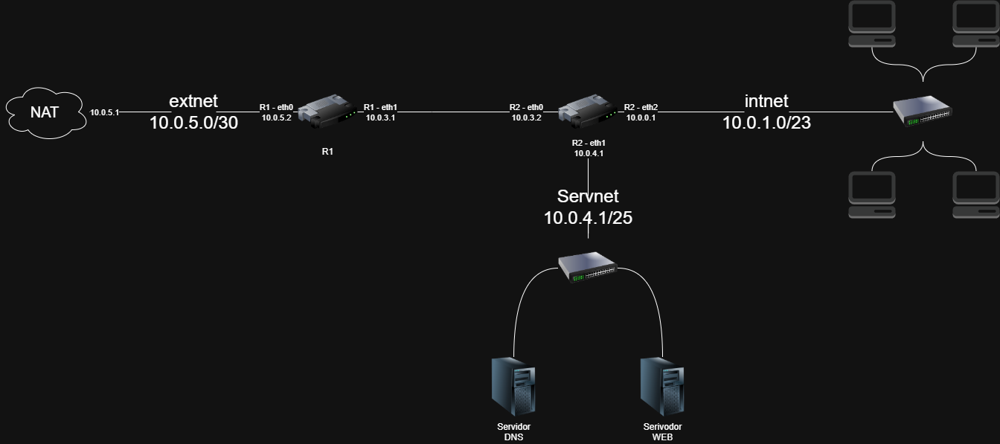

# Emulação de Infraestrutura de Rede com Mininet 🌐

> **Projeto prático** da disciplina de Laboratório de Redes de Computadores e Cibersegurança do Programa de Pós-Graduação em Ciência da Computação (PPGCC) - UTFPR, Campo Mourão.

## 📄 Sobre o Projeto
O objetivo principal desta atividade foi criar uma infraestrutura de rede emulada utilizando o Mininet para aprofundar os conhecimentos práticos em emulação de redes e roteamento estático avançado.

A infraestrutura completa foi orquestrada de forma programática através da API Python do Mininet e engloba redes internas segmentadas, uma rede dedicada de servidores e acesso simulado à internet via NAT.

## 🎯 Objetivos Alcançados
* **Rede Interna (`intnet`):** Projetada com subnetting para suportar o requisito de 500 máquinas simultâneas.
* **Rede de Servidores (`servnet`):** Segmentada com máscara ajustada para suportar 64 máquinas.
* **Roteamento e NAT:** Configuração de interfaces, IP Forwarding, tabelas de rotas em roteadores intermediários e nó NAT para garantir conectividade global.
* **QoS e Restrições:** Aplicação de limites físicos nos enlaces de comunicação (100Mb/s de largura de banda e 10ms de atraso) utilizando a classe `TCLink`.

## 🛠️ Tecnologias Utilizadas
* **Ambiente:** Máquina virtual Linux (VirtualBox ou VMWare).
* **Emulação e Scripts:** Mininet e sua API nativa em Python.
* **Análise e Testes:** iPerf3 (vazão e throughput), Wireshark/tcpdump (análise de pacotes `.pcap`) e utilitários de rede (`ping`, `traceroute`).

## 🗺️ Topologia e Endereçamento (Subnetting)
Para atender à capacidade exigida de hosts em cada segmento, o endereçamento foi estruturado da seguinte forma:

| Rede | Finalidade | Bloco CIDR | IP Gateway |
|---|---|---|---|
| **intnet** | Rede Interna | `10.0.0.0/23` | `10.0.1.1` |
| **servnet**| Rede de Servidores | `10.0.4.0/25` | `10.0.4.1` |
| **Ext/P2P**| Enlaces R1 <-> R2 | `10.0.3.0/30` | - |
| **NAT** | Ligação R1 <-> Internet| `10.0.5.0/29` | `10.0.5.1` |



## 🚀 Como Executar

1. Clone este repositório em sua máquina:
   ```bash
   git clone https://github.com/EricSL07/mininet.git
   ```
2. Certifique-se de estar em um ambiente Linux com as dependências do Mininet perfeitamente instaladas.
3. Execute o script principal do laboratório exigindo os privilégios de superusuário:
   ```bash
   sudo python script_mininet.py
   ```

## 📊 Validação e Testes Práticos
O ambiente foi configurado para atestar ativamente a estabilidade e as restrições da rede:
1. **Conectividade Completa:** Pacotes disparam do host de origem, alcançam os servidores Web/DNS locais e pingam com sucesso em IPs públicos externos (ex: `8.8.8.8`), validando assim a tradução NAT.
2. **Throughput Rigoroso:** Testes de vazão com o `iPerf3` limitam eficientemente a banda a ~100 Mbits/sec dentro dos cabos virtuais.
3. **Captura e Inspeção:** O código de infraestrutura executa instâncias silenciosas do `tcpdump`, persistindo dados em disco para uma avaliação profunda e posterior no software Wireshark.

## ✒️ Autor
**Éric Seles Lourenço**